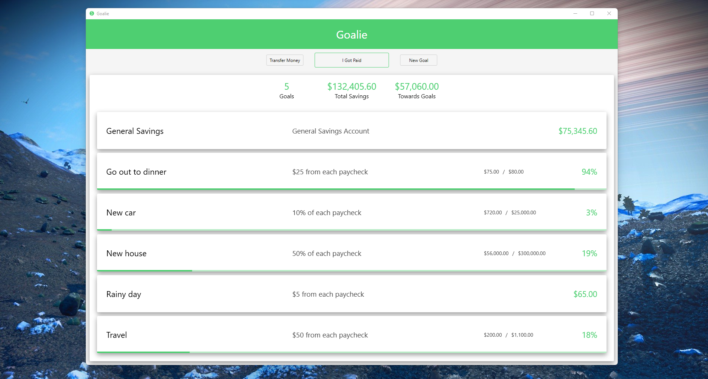

# Goalie
*Dead simple, open-source, free money saving program*

Hey! If you're looking for a guide of how to use
Goalie, you can skip this and just click 
[HERE](#how-to-use-the-program) (link to the section
"How to use the program" below)

The goal of Goalie is to be simple, out-of-the-way,
and private.

Goalie is *not* automated in the sense that it
will manage your money for you. It won't. You *dont*
put in your pay schedule, your pay amount, your
billing schedule, etc.

Goalie *is* automated in the sense that you can
describe your financial situation to it and it
will do all the numbers work for you.

You're going to need to tell Goalie every time
you get income, and you're going to need to
confess to it every time you spent from savings.

In a sense, this adds discipline to your spending,
but it isn't intended to shame you into not spending
money. It's just intended to make you aware of where
that money is going and what the actual value of it
is; what the impact of spending it will be.

Not only that, but Goalie keeps you fully aware
and up-to-date of your own savings. Not through
push notifications and alerts and *blah blah blah* -
but through your own care and attention.

The Goalie program never even contacts
the internet - not at any time at all;
absolutely no part of it's job description is
to go telling some strange people what you're doing.
Everything stays on your computer. Not even the
most basic of analytics. Nothing, never.

Lastly, you'll always be able to use Goalie
for free. If you're skilled with C# and WPF you
can fork a new version that suits your needs.
You can even just download the code make your
own hacked-together client in Visual Studio and
never show another soul.

(Note: in debug mode, your user data goes into
another folder. I can see this as a source of
confusion for anyone trying to play around with
the code.)

## Features (current)
- Create multiple goals
- Goals can accumulate fixed amounts or percentage of income
- Goals can also be managed manually
- Display progress towards goals

*A picture of the program running on my desktop*
*with one of my **No Man's Sky** wallpapers in*
*the background (not included). Unfortunately, the*
*numbers don't reflect my real savings.*

## Features (upcoming)
- Transaction logging to keep track of spending and income
- Bills system to group repeated payments into one button press

## How to use the program